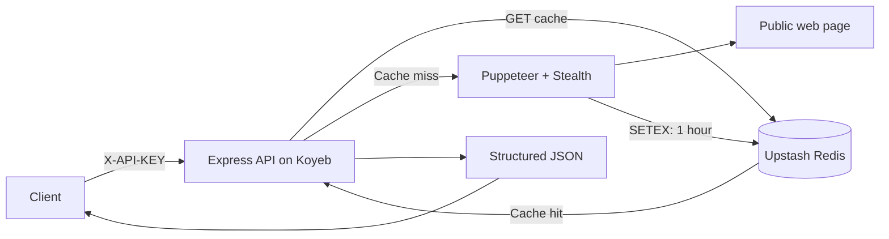

# Scrape Pipeline API

API מאומת לחילוץ תוכן ציבורי מדפי אינטרנט, עם **Puppeteer Stealth**, מטמון **Upstash Redis** ואריזה לפריסת Docker על Koyeb. המימוש מותאם במכוון למסלול Koyeb Free: שירות Web יחיד מבצע את החילוץ בתוך הבקשה ושומר את התוצאה במטמון Redis לשעה.

> הפרויקט מיועד לשימוש חוקי, מכבד ולפי תנאי השירות של אתרי היעד. אין לעקוף חומות תשלום, מנגנוני הרשאה, CAPTCHA או מגבלות גישה של אתר.

## ארכיטקטורה



הדפדפן פועל במצב headless עם דגלים מצמצמי זיכרון, חוסם תמונות, גופנים, מדיה ו־CSS, ומוגבל ל־15 שניות. רק חילוץ לא־מוטמן אחד מורשה בכל רגע כדי לצמצם סיכון לעומס זיכרון ב־Koyeb Free.

## יכולות

| רכיב | מימוש |
| --- | --- |
| API | Express, `POST /api/v1/extract` ו־`GET /health` |
| אימות | כותרת `X-API-KEY` עם השוואה קבועת־זמן |
| דפדפן | Puppeteer Extra עם Stealth Plugin, timeout של 15 שניות וניקוי `browser.close()` |
| מטמון | Upstash Redis באמצעות `ioredis`, תוקף של שעה |
| הגנה | חסימת כתובות פרטיות, כתובות עם credentials ורשתות פנימיות (SSRF) |
| פריסה | Dockerfile תואם Koyeb ו־GitHub Actions ל־lint, בדיקות ובניית Docker |

## הפעלה מקומית

דרושים Node.js 20+, Chromium מקומי, ו־Redis. אפשר להשתמש ב־Docker Compose אם Docker זמין.

```bash
git clone https://github.com/infinityempire/scrape-pipeline-api.git
cd scrape-pipeline-api
cp .env.example .env
# ערכו את .env ובחרו API_KEY בטוח
npm ci
npm start
```

ב־macOS או Linux שבו Chromium אינו בנתיב ברירת המחדל, הגדירו את `PUPPETEER_EXECUTABLE_PATH` לנתיב הבינארי המתאים.

להרצה עם Redis מקומי דרך Compose:

```bash
API_KEY="dev-secret" docker compose up --build
```

## משתני סביבה

| משתנה | נדרש | ברירת מחדל | תיאור |
| --- | --- | --- | --- |
| `PORT` | לא | `8080` | פורט ה־HTTP של השירות. |
| `REDIS_URL` | כן | — | כתובת `rediss://` של Upstash, כולל נקודתיים לפני הסיסמה. |
| `API_KEY` | כן | — | סוד לאימות קריאות API. |
| `SCRAPE_TIMEOUT_MS` | לא | `15000` | תקרת זמן החילוץ במילישניות. |
| `CACHE_TTL_SECONDS` | לא | `3600` | תוקף המטמון בשניות. |
| `MAX_REQUEST_BODY_BYTES` | לא | `10kb` | מגבלת גוף הבקשה. |
| `ALLOW_PRIVATE_NETWORKS` | לא | `false` | השאירו `false` בפריסה ציבורית. |

> ב־ioredis עם TLS, Upstash מתעדת כתובת בפורמט `rediss://:PASSWORD@ENDPOINT:PORT`; הנקודתיים שלפני הסיסמה נדרשים.[1]

## API

### `GET /health`

מחזיר את מצב השירות ואת קישוריות Redis. נקודה זו אינה דורשת API key כדי שמנגנון הבריאות של Koyeb יוכל להשתמש בה.

```json
{
  "status": "ok",
  "redis": "ready",
  "timestamp": "2026-08-19T00:00:00.000Z"
}
```

### `POST /api/v1/extract`

יש לכלול את `X-API-KEY` ואת ה־URL הציבורי לחילוץ.

```bash
curl --request POST https://YOUR-KOYEB-URL/api/v1/extract \
  --header 'Content-Type: application/json' \
  --header 'X-API-KEY: YOUR_SECRET' \
  --data '{"url":"https://example.com"}'
```

תגובה מוצלחת:

```json
{
  "cached": false,
  "data": {
    "title": "Example Domain",
    "text": "Example Domain ...",
    "metadata": {
      "description": null,
      "canonical": null,
      "language": "en",
      "charset": "UTF-8",
      "requestedUrl": "https://example.com/",
      "finalUrl": "https://example.com/",
      "statusCode": 200,
      "contentType": "text/html"
    },
    "timestamp": "2026-08-19T00:00:00.000Z"
  }
}
```

קריאה נוספת לאותו URL לפני תום שעה מחזירה `cached: true` ומונעת פתיחת דפדפן חדשה.

| סטטוס | משמעות |
| ---: | --- |
| `200` | חילוץ או תוצאת מטמון הוחזרו. |
| `400` | בקשה לא תקינה או URL לא ציבורי/לא בטוח. |
| `401` | `X-API-KEY` חסר או שגוי. |
| `429` | חילוץ לא־מוטמן אחר עדיין רץ; נסו שוב לאחר כ־15 שניות. |
| `502` | החילוץ נכשל מול אתר היעד. |
| `504` | אתר היעד לא נטען בתוך מגבלת הזמן. |

## פריסה ללא עלות חודשית

המדריך המלא נמצא ב־[`DEPLOYMENT.md`](./DEPLOYMENT.md). Koyeb מאפשרת Web Service חינמי אחד של 512MB RAM ו־0.1 vCPU, אשר יורד לאפס לאחר שעה ללא תעבורה; הוא מיועד לניסויים ופרויקטי hobby, ולא לפרודקשן.[2] Upstash Free מספקת 256MB ו־500,000 פקודות Redis בחודש.[3]

בגלל מגבלות אלה, גרסה זו מתאימה לבדיקות, דמואים ונפח בקשות נמוך. היא **אינה** תחליף לשירות scraping יציב בעומס גבוה.

## בדיקות ורציפות

```bash
npm run lint
npm test
```

ה־workflow ב־`.github/workflows/ci.yml` מריץ התקנת תלויות, בדיקות תחביר, בדיקות יחידה ובניית תמונת Docker בכל pull request ובכל דחיפה ל־`main`.

## מקורות

[1]: https://upstash.com/docs/redis/troubleshooting/no_auth "Upstash: ioredis TLS URL format"
[2]: https://www.koyeb.com/docs/reference/instances "Koyeb Free Instances"
[3]: https://upstash.com/pricing/redis "Upstash Redis Pricing"
