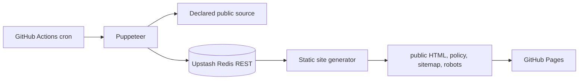

# Scrape Pipeline Static Site

צינור אוטומטי ליצירת **אתר נתונים סטטי** ממקור ציבורי יחיד. GitHub Actions מריץ Puppeteer כל שש שעות, שומר נתון ב־Upstash Redis, מייצר דפי HTML, ומעלה את התוצאה ל־GitHub Pages.

> יש להשתמש רק במקור ציבורי שיש לכם זכות לגשת אליו ולהציג ממנו קטע קצר. אין לעקוף חומת תשלום, CAPTCHA, הרשאה, הוראות `robots` או מגבלות גישה. הנתונים באתר הם תצפית ממקור חיצוני ולא ייעוץ, המלצה או הבטחה לתוצאה.

## ארכיטקטורה



הדפדפן רץ רק בתוך runner מתוזמן. האתר הסטטי אינו מפעיל Chromium ואינו קורא ל־Upstash בדפדפן המבקר. בכל ריצה נבנים דף ראשי, דף מקור, דף מדיניות, `sitemap.xml` ו־`robots.txt`.

## רכיבי הפרויקט

| קובץ | אחריות |
| --- | --- |
| `src/scraper.js` | חילוץ מתוזמן, חסימת משאבים כבדים, הגנת SSRF ואימות אישור מקור. |
| `src/upstash.js` | לקוח REST ל־Upstash עבור `GET`, `SET EX` ו־`PING`. |
| `src/build_site.js` | יצירת דפים, ייחוס מקור, קטע מוגבל, דף מדיניות, גילוי נאות ובקרות אינדוקס. |
| `src/server.js` | API מקומי קל, המגיש נתון שכבר נמצא במטמון. |
| `CONTENT_POLICY.md` | מדיניות מקור, שקיפות, מונטיזציה ואינדוקס. |
| `.github/workflows/pipeline.yml` | סריקה, בנייה ופריסה כל שש שעות או ידנית. |

## הגדרה ראשונית

### 1. Upstash Redis

צרו מסד Redis בתוכנית Free ב־[Upstash Console](https://console.upstash.com/) והעתיקו את **REST URL** ואת **REST Token**. Upstash תומכת בפקודות Redis דרך HTTPS, ללא חיבור TCP מתמשך.[1]

### 2. GitHub Actions secrets

ב־**Settings → Secrets and variables → Actions** הגדירו את הערכים הבאים:

| Secret | נדרש | תיאור |
| --- | --- | --- |
| `TARGET_URL` | כן | כתובת HTTPS ציבורית אחת לסריקה. |
| `UPSTASH_REDIS_REST_URL` | כן | כתובת ה־REST מ־Upstash. |
| `UPSTASH_REDIS_REST_TOKEN` | כן | אסימון הכתיבה מ־Upstash. |
| `SOURCE_PERMISSION_CONFIRMED` | כן | הערך `true` רק לאחר אישור שיש לכם זכות לגשת למקור ולהציג ממנו קטע. |
| `PAYPAL_ME_LINK` | לא | קישור HTTPS לתמיכה מרצון בלבד. |
| `ADSENSE_PUB_ID` | לא | מזהה `ca-pub-` רק לאחר אישור AdSense. |
| `ORIGINAL_VALUE_STATEMENT` | נדרש לאינדוקס | תיאור של לפחות 30 תווים של הערך המקורי שהאתר מספק. |
| `ENABLE_SEARCH_INDEXING` | נדרש לאינדוקס | הערך `true` רק לאחר בדיקת הרשאה, ערך מוסף ודפי מדיניות. |

### 3. GitHub Pages

ב־**Settings → Pages**, בחרו **Source: GitHub Actions**. GitHub Pages זמינה ללא עלות במאגרים ציבוריים של GitHub Free; המאגר הזה כבר ציבורי, ולכן אסור לשמור בו סודות או תוכן פרטי.[2] [3]

### 4. ריצה ידנית ראשונה

פתחו **Actions → Scheduled scrape, build, and publish → Run workflow**. ה־workflow ישמור את הנתון ב־Upstash, יבנה את האתר ויפרסם אותו ב־GitHub Pages.

## מקור, אינדוקס ומונטיזציה

הסריקה לא תתחיל בלי `SOURCE_PERMISSION_CONFIRMED=true`. בנוסף, האתר נשאר עם `noindex,nofollow` כברירת מחדל ו־`robots.txt` חוסם סורקים. אינדוקס דורש את שלושת התנאים: אישור מקור, `ENABLE_SEARCH_INDEXING=true`, ו־`ORIGINAL_VALUE_STATEMENT` תקין. Google מציינת שפרסום דפים רבים שנוצרים בעיקר לצורך דירוגים או מפרסמים תוכן סרוק ללא ערך מוסף עשוי להיחשב abuse.[4]

קישור PayPal הוא תמיכה מרצון בלבד ואינו הבטחת הכנסה. אין כרגע קישורי Affiliate באתר; אם יתווספו בעתיד, יש לסמן אותם בגילוי נאות ולהשתמש ב־`rel="sponsored nofollow"`. פרסום AdSense דורש אישור ותאימות למדיניות, לרבות איסור על קליקים או חשיפות מלאכותיים ועל ניווט מטעה.[5] גילוי נאות נדרש כאשר קשר פיננסי עלול להשפיע על הערכת המבקר.[6]

## עבודה מקומית

```bash
git clone https://github.com/infinityempire/scrape-pipeline-api.git
cd scrape-pipeline-api
cp .env.example .env
npm ci
npm run scrape
npm run build:site
npm start
```

השרת המקומי כולל `GET /api/v1/data` ו־`GET /health`; הוא מגיש תוצאת מטמון ואינו מפעיל Puppeteer.

## בדיקות

```bash
npm run lint
npm test
```

## מקורות

[1]: https://upstash.com/docs/redis/features/restapi "Upstash Redis REST API"
[2]: https://docs.github.com/en/pages/getting-started-with-github-pages/using-custom-workflows-with-github-pages "GitHub Pages custom workflows"
[3]: https://docs.github.com/en/pages/getting-started-with-github-pages/what-is-github-pages "GitHub Pages availability"
[4]: https://developers.google.com/search/docs/essentials/spam-policies "Google Search spam policies"
[5]: https://support.google.com/adsense/answer/48182?hl=en "AdSense Program policies"
[6]: https://www.ftc.gov/business-guidance/resources/ftcs-endorsement-guides-what-people-are-asking "FTC Endorsement Guides"
