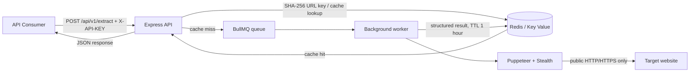

# Scrape Pipeline API

**Scrape Pipeline API** הוא שירות Node.js מאומת לחילוץ טקסט ומטא־נתונים מדפי HTTP/HTTPS ציבוריים. השירות משתמש במטמון Redis עם תוקף של שעה ובתור BullMQ, כדי למנוע חילוצים כפולים ולהפריד בין בקשות HTTP לבין פעולת הדפדפן עתירת המשאבים.

> השירות מיועד רק לחילוץ תוכן שהלקוח מורשה לגשת אליו. יש לכבד תנאי שימוש, `robots.txt`, מגבלות קצב, דרישות פרטיות וזכויות יוצרים של כל אתר יעד.

## ארכיטקטורה



| רכיב | אחריות |
| --- | --- |
| `src/server.js` | מאמת `X-API-KEY`, מאמת את בקשת הלקוח, מחפש במטמון, מכניס משימה לתור ומחזיר תוצאה. |
| `src/worker.js` | עובד נפרד שמריץ את פעולת הדפדפן ושומר תוצאות במטמון. |
| `src/scraper.js` | מפעיל Chromium במצב headless, חוסם תמונות, גופנים, מדיה ו־CSS, ומחזיר JSON מובנה. |
| `src/urlSafety.js` | חוסם סכמות לא נתמכות, כתובות עם הרשאות, מארחים מקומיים ורשתות פרטיות כדי לצמצם SSRF. |
| Redis + BullMQ | מספקים מטמון משותף, תור עבודה, ניסיונות חוזרים והפרדת עומס בין ה־API לעובד. |

## מאפייני השירות

ה־API מקבל רק כתובות `http` ו־`https` ציבוריות. לפני ניווט, הוא בודק את הכתובת ואת פתרון ה־DNS שלה, וחוסם כתובות מקומיות ופרטיות כברירת מחדל. כל משימה מוגבלת ל־15 שניות. Chromium מופעל עם דגלי חיסכון במשאבים ועם חסימת סוגי משאבים שאינם נחוצים לחילוץ טקסט.

הפלט התקני הוא:

```json
{
  "title": "Example Domain",
  "text": "Example Domain This domain is for use in illustrative examples...",
  "metadata": {
    "description": null,
    "canonical": null,
    "language": "en",
    "charset": "UTF-8",
    "requestedUrl": "https://example.com/",
    "finalUrl": "https://example.com/",
    "statusCode": 200,
    "contentType": "text/html"
  },
  "timestamp": "2026-08-18T00:00:00.000Z"
}
```

## התחלה מהירה

### דרישות מוקדמות

נדרשים Docker ו־Docker Compose להפעלה המקומית המומלצת. קובץ ה־Docker מתקין Chromium ואת התלויות הדרושות לו, ולכן אין צורך להתקין דפדפן במערכת המארחת.

```bash
cp .env.example .env
# ערוך את .env והחלף את API_KEY בערך אקראי וארוך.
docker compose up --build
```

הפעלת `docker compose up` מעלה שלושה שירותים: `api`, `worker` ו־`redis`. שירות ה־API יהיה זמין ב־`http://localhost:3000`.

### בדיקת תקינות

```bash
curl http://localhost:3000/health
```

תגובה תקינה כוללת `status: "ok"` ו־`redis: "ready"`.

### בקשת חילוץ

```bash
curl --request POST http://localhost:3000/api/v1/extract \
  --header 'Content-Type: application/json' \
  --header 'X-API-KEY: החלף-במפתח-שלך' \
  --data '{"url":"https://example.com"}'
```

בפעם הראשונה מוחזר `{ "cached": false, "data": { ... } }`. בקשות חוזרות לאותה כתובת מנורמלת במהלך שעה מוחזרות מ־Redis בתבנית `{ "cached": true, "data": { ... } }`.

## מפרט API

| שיטה ונתיב | אימות | גוף / פרמטרים | תגובה |
| --- | --- | --- | --- |
| `GET /health` | לא נדרש | ללא | `200` כאשר Redis זמין, או `503` כאשר אינו זמין. |
| `POST /api/v1/extract` | `X-API-KEY` חובה | `{ "url": "https://example.com" }` | `200` עם נתוני החילוץ והסימון `cached`. |

| קוד | משמעות |
| --- | --- |
| `400 INVALID_REQUEST` | גוף הבקשה אינו מכיל מחרוזת `url` תקינה. |
| `400 UNSAFE_URL` | יעד מקומי, כתובת רשת פרטית, סכֵמה שאינה HTTP/S או URL עם פרטי גישה. |
| `401 UNAUTHORIZED` | הכותרת `X-API-KEY` חסרה או שגויה. |
| `502 SCRAPE_FAILED` | הדפדפן לא הצליח לחלץ את היעד. |
| `504 SCRAPE_TIMEOUT` | פעולת החילוץ חרגה ממגבלת הזמן. |

## הגדרות סביבה

| משתנה | חובה | ברירת מחדל | תיאור |
| --- | --- | --- | --- |
| `PORT` | לא | `3000` | פורט ההאזנה של ה־API. |
| `REDIS_URL` | כן | — | כתובת חיבור Redis, למשל `redis://redis:6379`. |
| `API_KEY` | כן | — | סוד משותף לבקשות הלקוח. יש לשמור רק במנהל סודות. |
| `SCRAPE_TIMEOUT_MS` | לא | `15000` | זמן מרבי לחילוץ של משימה אחת במילישניות. |
| `CACHE_TTL_SECONDS` | לא | `3600` | תוקף פריט מטמון בשניות. |
| `WORKER_CONCURRENCY` | לא | `2` | מספר משימות חילוץ במקביל לכל עובד. |
| `ALLOW_PRIVATE_NETWORKS` | לא | `false` | מיועד רק לפיתוח מקומי מבוקר; אין להפעיל בפרודקשן. |

## בדיקות ו־CI

```bash
npm ci
npm run lint
npm test
```

ה־workflow ב־`.github/workflows/ci.yml` מריץ התקנת תלויות, בדיקת תחביר, בדיקות יחידה ובניית תמונת Docker בכל pull request ובכל דחיפה ל־`main`.

## פריסה

### מסלול חינמי מומלץ: Oracle Cloud Always Free

הפריסה החינמית המומלצת מריצה את ה־API, ה־Worker, Redis ו־Caddy על מכונת Oracle Always Free אחת. קובצי הפריסה והוראות היצירה נמצאים תחת [`deploy/oracle`](./deploy/oracle/), והמדריך המלא נמצא ב־[`ORACLE_DEPLOYMENT.md`](./deploy/oracle/ORACLE_DEPLOYMENT.md). Oracle מפרסמת משאבי Compute מסוג Always Free שמאפשרים להריץ מכונה כזו כל עוד נשארים בתוך המכסה החודשית.[1]

### חלופת Render בתשלום

המאגר כולל גם `render.yaml` שמגדיר שירות Web ל־API, שירות Worker לתור ושירות Key Value תואם Redis. Render Blueprints תומכים בהגדרת שירותי Docker, משתני סביבה והפניות בין שירותים בקובץ `render.yaml`; שירות Key Value מספק כתובות חיבור תואמות Redis ומתאים למטמון ולתורי עבודה.[2][3]

להוראות פריסת Render, כולל החיבור של `REDIS_URL`, סודות, רציפות פריסה ומונטיזציה, ראו [`DEPLOYMENT_INSTRUCTIONS.md`](./DEPLOYMENT_INSTRUCTIONS.md).

## קיבולת ותפעול

לשיפור התפוקה, הגדילו בהדרגה את מספר העובדים או את `WORKER_CONCURRENCY`, לאחר מדידת CPU, זיכרון והשהיה. מכיוון שכל משימה מפעילה דפדפן, הגדלת מקביליות ללא הגדלת משאבים עשויה לפגוע ביציבות. בפרודקשן יש לשים שער API או proxy לפני השירות, להחיל rate limits לפי צרכן, למדוד זמני תור ושיעורי כשל, ולמחזר את `API_KEY` באופן תקופתי.

## מקורות

[1]: https://www.oracle.com/cloud/free/ "Oracle Cloud Free Tier"
[2]: https://render.com/docs/blueprint-spec "Render Blueprint YAML Reference"
[3]: https://render.com/docs/key-value "Render Key Value documentation"
