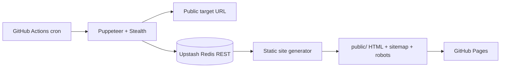

# Scrape Pipeline Static Site

צינור אוטומטי ליצירת **אתר נתונים סטטי** מתוך מקור ציבורי יחיד. GitHub Actions מריץ Puppeteer בכל שש שעות, שומר את הנתון המעובד ב־Upstash Redis, מייצר דפי HTML וספריות חיפוש, ומעלה את התוצאה ל־GitHub Pages.

> יש להשתמש רק בנתונים ציבוריים שהשימוש בהם מותר לפי תנאי המקור. אין לעקוף חומת תשלום, CAPTCHA, הרשאה, robots directives או מגבלות גישה של האתר. כל טענה עובדתית חשובה באתר המופק צריכה להיבדק מול המקור המקורי.

## ארכיטקטורה



הדפדפן רץ רק בתוך runner מתוזמן. האתר הסטטי אינו מפעיל Chromium ואינו קורא ל־Upstash מדפדפן המבקר. בכל ריצה, הנתון נשמר ל־24 שעות וממנו נבנים `index.html`, דף פירוט, `sitemap.xml` ו־`robots.txt`.

## רכיבי הפרויקט

| קובץ | אחריות |
| --- | --- |
| `src/scraper.js` | חילוץ מתוזמן עם Puppeteer Stealth, חסימת משאבים כבדים ושמירה ב־Upstash. |
| `src/upstash.js` | לקוח REST ל־Upstash עבור `GET`, `SET EX` ו־`PING`. |
| `src/build_site.js` | יצירת האתר הסטטי, מטא־דאטה לחיפוש ומכלי מונטיזציה. |
| `src/server.js` | API קל לשימוש מקומי בלבד, המגיש נתון שכבר נמצא במטמון. |
| `.github/workflows/pipeline.yml` | סריקה, בנייה והעלאה ל־GitHub Pages כל שש שעות או ידנית. |

## הגדרה ראשונית

### 1. צרו מסד Upstash Redis

צרו מסד Redis ב־[Upstash Console](https://console.upstash.com/). לאחר מכן העתיקו את שני ערכי ה־REST API: **REST URL** ו־**REST Token**. Upstash תומכת בפקודות Redis דרך HTTPS עם כותרת Authorization, ולכן אין צורך בחיבור TCP מתמשך.[1]

### 2. הוסיפו GitHub Actions secrets

במאגר GitHub פתחו **Settings → Secrets and variables → Actions → New repository secret** והוסיפו את הערכים הבאים:

| Secret | נדרש | תיאור |
| --- | --- | --- |
| `TARGET_URL` | כן | כתובת HTTPS ציבורית אחת לסריקה. |
| `UPSTASH_REDIS_REST_URL` | כן | כתובת ה־REST מ־Upstash. |
| `UPSTASH_REDIS_REST_TOKEN` | כן | אסימון ה־REST מ־Upstash. |
| `PAYPAL_ME_LINK` | לא | קישור HTTPS לחשבון PayPal.Me שיוצג כלחצן תמיכה. |
| `ADSENSE_PUB_ID` | לא | מזהה בפורמט `ca-pub-` בן 16 ספרות, לאחר אישור AdSense. |

`PAYPAL_ME_LINK` ו־`ADSENSE_PUB_ID` מוזרקים רק בשלב הבנייה של GitHub Actions. אין צורך לשמור אותם בקוד, ב־HTML המקור או ב־`.env` שמועלה ל־Git. המזהה של AdSense והקישור ל־PayPal יופיעו לבסוף בדף הציבורי, משום שזה נדרש לפעולתן של התבניות.

### 3. הפעלת GitHub Pages

ב־**Settings → Pages**, בחרו **Source: GitHub Actions**. ה־workflow משתמש ב־`actions/upload-pages-artifact` וב־`actions/deploy-pages`, נתיב הפריסה הרשמי של GitHub Pages עבור אתר סטטי.[2]

> **מגבלת התוכנית החינמית:** GitHub Pages זמינה ללא עלות עבור מאגרים **ציבוריים** ב־GitHub Free. המאגר הנוכחי הוא פרטי, ולכן כדי לעמוד ביעד של $0 יש לשנות את הנראות שלו ל־Public לפני הפעלת Pages. אין לבצע זאת אם קוד המקור או תיאור הפרויקט אינם מיועדים לחשיפה.[3]

### 4. הפעלה ידנית ראשונה

ב־GitHub פתחו **Actions → Scheduled scrape, build, and publish → Run workflow**. לאחר שה־workflow יסתיים בהצלחה, GitHub Pages תציג את כתובת האתר ב־Settings → Pages.

## תבניות מונטיזציה

מחולל האתר יוצר תמיד מקום ייעודי ל־Affiliate. כאשר מוגדר `ADSENSE_PUB_ID` תקין, הוא מוסיף את script ה־AdSense ואת תג `ins.adsbygoogle`. כאשר מוגדר `PAYPAL_ME_LINK` תקין, הוא מוסיף לחצן תמיכה. אין בקוד מנגנון של מעקף מדיניות, קליקים מלאכותיים, חיוב משתמשים או טיפול בכסף.

פרסום, אפיליאייט ותשלומים כפופים לתנאי השירות של כל ספק ולדרישות גילוי נאות, מדיניות תוכן ואישור חשבון. האתר חייב לכלול תוכן שימושי ומקורי, ולא להציג נתונים סרוקים כאילו נכתבו על ידכם.

## עבודה מקומית

```bash
git clone https://github.com/infinityempire/scrape-pipeline-api.git
cd scrape-pipeline-api
cp .env.example .env
npm ci
```

לאחר עריכת `.env`, אפשר להריץ:

```bash
npm run scrape
npm run build:site
npm start
```

השרת המקומי כולל `GET /api/v1/data` ו־`GET /health`; הוא מגיש רק תוצאת מטמון ולא מפעיל Puppeteer.

## בדיקות

```bash
npm run lint
npm test
```

## מקורות

[1]: https://upstash.com/docs/redis/features/restapi "Upstash Redis REST API"
[2]: https://docs.github.com/en/pages/getting-started-with-github-pages/using-custom-workflows-with-github-pages "GitHub Pages custom workflows"
[3]: https://docs.github.com/en/pages/getting-started-with-github-pages/what-is-github-pages "GitHub Pages availability"
