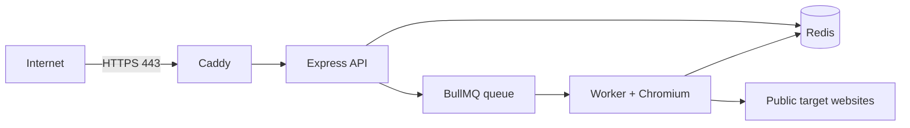

# פריסה חינמית על Oracle Cloud Always Free

מדריך זה מעביר את **Scrape Pipeline API** למכונת Oracle Cloud אחת, ללא שירותי Render. אותה מכונה מריצה את ה־API, את עובד BullMQ, Redis ו־Caddy ל־HTTPS. זו חלופת עלות חודשית אפסית כל עוד נשארים במשאבי **Always Free** של Oracle.

> יש לבחור *רק* משאבי Always Free. אם המסך מציג עלות, תוכנית בתשלום, או ניסיון להמיר לחשבון Pay As You Go — עצרו ואל תאשרו את הפעולה.

## ארכיטקטורת הפריסה



## 1. יצירת מכונת Always Free

ב־Oracle Cloud Console בחרו **Compute → Instances → Create instance**. Oracle מתעדת שהטופס כולל הגדרות בסיסיות, אבטחה, רשת ואחסון.[1]

| הגדרה | ערך מומלץ | הערה |
| --- | --- | --- |
| שם | `scrape-pipeline-api` | שם תיאורי בלבד. |
| Image | Ubuntu 24.04 aarch64 | תואם ל־Ampere ול־Docker. |
| Shape | `VM.Standard.A1.Flex` | חייב להיות מסומן Always Free. |
| OCPUs | `2` | מספיק לנקודת התחלה שמרנית של Chromium. |
| Memory | `12 GB` | משאיר מרווח לעובד, Redis וה־API. |
| Boot volume | `50 GB` | נשאר במסגרת אחסון Always Free. |
| Public IPv4 | מופעל | נדרש ל־SSH ול־HTTPS ציבורי. |
| SSH key | מפתח `ed25519` חדש | אין להעלות מפתח פרטי ל־Git. |

התצורה של 2 OCPUs ו־12 GB צורכת לכל היותר 1,488 OCPU-hours ו־8,928 GB-hours בחודש בן 31 יום, ולכן נשארת בתוך ההקצאה החודשית של 1,500 OCPU-hours ו־9,000 GB-hours ש־Oracle מפרסמת ל־Ampere Always Free.[2]

אם Oracle מציגה שגיאת קיבולת עבור Ampere, אל תבחרו צורה בתשלום. נסו Availability Domain אחר או נסו שוב מאוחר יותר. אפשר גם להשתמש זמנית ב־AMD Always Free, אך הזיכרון המועט שלה אינו מתאים בצורה טובה להרצת Chromium, Redis וה־API יחד.

## 2. חוקי גישה ברשת Oracle

ב־VCN של המכונה, פתחו את **Security List** או **Network Security Group** והוסיפו רק את חוקי ה־ingress הבאים. Security Lists משמשים כחומת אש וירטואלית של OCI.[3]

| פרוטוקול | פורט יעד | מקור | מטרה |
| --- | ---: | --- | --- |
| TCP | 22 | כתובת ה־IP הציבורית שלכם בלבד (`x.x.x.x/32`) | SSH לניהול. |
| TCP | 80 | `0.0.0.0/0` | אתגרי HTTP והפניה ל־HTTPS. |
| TCP | 443 | `0.0.0.0/0` | ה־API הציבורי המאובטח. |

אין לפתוח את פורט `3000` של ה־API ואת פורט `6379` של Redis. הם נשארים פנימיים לרשת Docker בלבד.

## 3. הגדרת DNS

צרו רשומת `A` אצל ספק הדומיין שלכם, למשל:

```text
api.example.com  →  כתובת IPv4 הציבורית של מכונת Oracle
```

המתינו עד שה־DNS מחזיר את כתובת המכונה. Caddy משתמש בשם הדומיין לקבלת תעודת HTTPS אוטומטית, ולכן יש לבצע שלב זה לפני ההפעלה הראשונה.

## 4. חיבור והכנת המכונה

התחברו למכונה מהמחשב שלכם:

```bash
ssh -i ~/.ssh/oci_free ubuntu@ORACLE_PUBLIC_IP
```

לאחר ההתחברות, הורידו והריצו את סקריפט ה־bootstrap השמור במאגר:

```bash
git clone https://github.com/infinityempire/scrape-pipeline-api.git
cd scrape-pipeline-api
chmod +x deploy/oracle/bootstrap.sh
./deploy/oracle/bootstrap.sh
```

הסקריפט מתקין Docker, Git ו־UFW, מפעיל את Docker, ומאפשר רק SSH, HTTP ו־HTTPS ב־firewall של המכונה. ה־firewall של OCI מהשלב הקודם עדיין נדרש בנפרד.

## 5. הגדרת הסודות והפעלת השירות

צרו קובץ סודות שאינו נכנס ל־Git:

```bash
cp deploy/oracle/.env.production.example .env
nano .env
```

הגדירו את `DOMAIN` כשם שהגדרתם ב־DNS ואת `API_KEY` כסוד ארוך. אפשר ליצור מפתח כך:

```bash
openssl rand -base64 32
```

הפעילו את כל רכיבי השירות:

```bash
sudo docker compose --env-file .env -f deploy/oracle/docker-compose.yml up -d --build
```

בדקו את מצב הקונטיינרים ואת הלוגים:

```bash
sudo docker compose --env-file .env -f deploy/oracle/docker-compose.yml ps
sudo docker compose --env-file .env -f deploy/oracle/docker-compose.yml logs --tail=100 api worker caddy
```

## 6. אימות חיצוני

לאחר ש־Caddy השלים את קבלת התעודה, בדקו:

```bash
curl https://api.example.com/health
```

לאחר מכן בדקו בקשת חילוץ עם המפתח שהגדרתם:

```bash
curl --request POST https://api.example.com/api/v1/extract \
  --header 'Content-Type: application/json' \
  --header 'X-API-KEY: החלף-במפתח-האמיתי' \
  --data '{"url":"https://example.com"}'
```

התגובה הראשונה אמורה לכלול `cached: false`; בקשה חוזרת לאותה כתובת בתקופת תוקף המטמון תכלול `cached: true`.

## עדכון גרסה

בכל עדכון לקוד במאגר:

```bash
cd ~/scrape-pipeline-api
git pull --ff-only origin main
sudo docker compose --env-file .env -f deploy/oracle/docker-compose.yml up -d --build
```

## תפעול ואבטחה

| נושא | פעולה נדרשת |
| --- | --- |
| גיבוי | גַבו את volume של Redis ואת קובץ `.env` באופן מאובטח. |
| עדכוני מערכת | הריצו מדי חודש `sudo apt-get update && sudo apt-get upgrade`. |
| SSH | השאירו פתוח רק לכתובת ה־IP שלכם; השתמשו במפתחות ולא בסיסמה. |
| API | הפיצו את `API_KEY` רק ללקוחות מורשים; החליפו אותו אם נחשף. |
| ניטור | בדקו מדי פעם `docker compose ps`, לוגים, ומכסת Always Free ב־Oracle Console. |
| מטבעות דפדפן | הגדילו `WORKER_CONCURRENCY` רק לאחר בדיקת CPU, זיכרון וזמני תגובה. |

## מקורות

[1]: https://docs.oracle.com/iaas/Content/Compute/Tasks/launchinginstance.htm "Oracle: Creating an Instance"
[2]: https://www.oracle.com/cloud/free/ "Oracle Cloud Free Tier"
[3]: https://docs.oracle.com/iaas/Content/Network/Concepts/securitylists.htm "Oracle: Security Lists"
